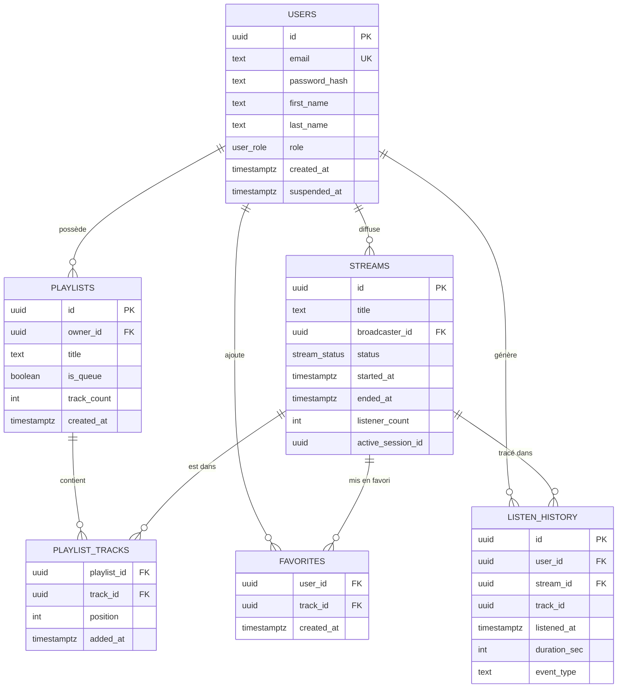

# Schéma de base de données — MCD / MPD

Base de données PostgreSQL hébergée sur Supabase. Le schéma est défini par 11 migrations
appliquées séquentiellement (`migrations/001_init.sql` → `migrations/011_favorites_playlists_reference_streams.sql`).

## MCD — Diagramme Entité-Relation

Depuis la migration 011, `favorites.track_id` et `playlist_tracks.track_id` référencent
`streams(id)` et non `tracks(id)` — dans StreamPulse le contenu favori/playlistable est
un stream live.

## MPD — Tables et colonnes

### Table `users` — Comptes utilisateurs (RLS activé)

| Colonne | Type | Contrainte | Description |
| --- | --- | --- | --- |
| `id` | UUID | PK · DEFAULT gen_random_uuid() | Identifiant unique |
| `email` | TEXT | UNIQUE · NOT NULL | Adresse email (identifiant de connexion) |
| `password_hash` | TEXT | NOT NULL | Hash bcrypt — jamais exposé via l'API |
| `first_name` | TEXT | NOT NULL DEFAULT '' | Prénom affiché sur les streams |
| `last_name` | TEXT | NOT NULL DEFAULT '' | Nom de famille |
| `role` | user_role | NOT NULL DEFAULT 'user' | ENUM : anon · user · diffuseur · admin |
| `created_at` | TIMESTAMPTZ | NOT NULL DEFAULT NOW() | Date de création du compte |
| `suspended_at` | TIMESTAMPTZ | NULL | Date de suspension (migration 006) — null = actif |

### Table `streams` — Diffusions live (RLS activé)

| Colonne | Type | Contrainte | Description |
| --- | --- | --- | --- |
| `id` | UUID | PK | Identifiant du stream (canal réutilisable) |
| `title` | TEXT | NOT NULL | Titre de la diffusion |
| `broadcaster_id` | UUID | FK → users(id) CASCADE | Diffuseur |
| `status` | stream_status | NOT NULL DEFAULT 'live' | ENUM : live · ended |
| `started_at` | TIMESTAMPTZ | NOT NULL DEFAULT NOW() | Début de la diffusion |
| `ended_at` | TIMESTAMPTZ | NULL | Fin de la diffusion |
| `listener_count` | INT | NOT NULL DEFAULT 0 | Nombre d'auditeurs en temps réel |
| `active_session_id` | UUID | NULL · CHECK cohérence | UUID de session renouvelé à chaque live (migration 010) |

### Table `playlists` — Bibliothèques personnelles (RLS activé)

| Colonne | Type | Contrainte | Description |
| --- | --- | --- | --- |
| `id` | UUID | PK | Identifiant de la playlist |
| `owner_id` | UUID | FK → users(id) CASCADE | Propriétaire |
| `title` | TEXT | NOT NULL | Nom de la playlist |
| `is_queue` | BOOLEAN | NOT NULL DEFAULT FALSE | true = file de lecture automatique |
| `track_count` | INT | NOT NULL DEFAULT 0 | Dénormalisé — maintenu par trigger (migration 005) |
| `created_at` | TIMESTAMPTZ | NOT NULL DEFAULT NOW() | Date de création |

### Table `playlist_tracks` — Items de playlist

| Colonne | Type | Contrainte | Description |
| --- | --- | --- | --- |
| `playlist_id` | UUID | PK · FK → playlists(id) CASCADE | Playlist parente |
| `track_id` | UUID | PK · FK → streams(id) CASCADE | Stream ajouté (réf. streams depuis migration 011) |
| `position` | INT | NOT NULL | Ordre dans la playlist |
| `added_at` | TIMESTAMPTZ | NOT NULL DEFAULT NOW() | Date d'ajout |

### Table `favorites` — Streams mis en favori

| Colonne | Type | Contrainte | Description |
| --- | --- | --- | --- |
| `user_id` | UUID | PK · FK → users(id) CASCADE | Utilisateur |
| `track_id` | UUID | PK · FK → streams(id) CASCADE | Stream mis en favori (réf. streams depuis migration 011) |
| `created_at` | TIMESTAMPTZ | NOT NULL DEFAULT NOW() | Date d'ajout aux favoris |

### Table `listen_history` — Historique d'écoute (RLS activé)

| Colonne | Type | Contrainte | Description |
| --- | --- | --- | --- |
| `id` | UUID | PK · DEFAULT gen_random_uuid() | Clé surrogate (migration 008) |
| `user_id` | UUID | FK → users(id) CASCADE | Auditeur |
| `stream_id` | UUID | FK → streams(id) SET NULL | Stream écouté |
| `track_id` | UUID | NULL | Référence optionnelle à un track |
| `listened_at` | TIMESTAMPTZ | NOT NULL DEFAULT NOW() | Horodatage de l'événement |
| `duration_sec` | INT | NOT NULL DEFAULT 0 | Durée d'écoute en secondes |
| `event_type` | TEXT | CHECK IN ('join','leave') | Type d'événement — migration 009 |

## Notes importantes

**Trigger `trg_playlist_track_count`** (migration 005) — Ce trigger PostgreSQL maintient
`playlists.track_count` à jour après chaque INSERT ou DELETE sur `playlist_tracks`,
évitant un COUNT(*) coûteux à chaque lecture de playlist.

**Row Level Security** — Toutes les tables sensibles ont RLS activé. Chaque utilisateur
n'accède qu'à ses propres données. Les streams sont publics en lecture (`FOR SELECT USING (TRUE)`).
Les admins disposent de policies dédiées avec vérification du rôle en base.
