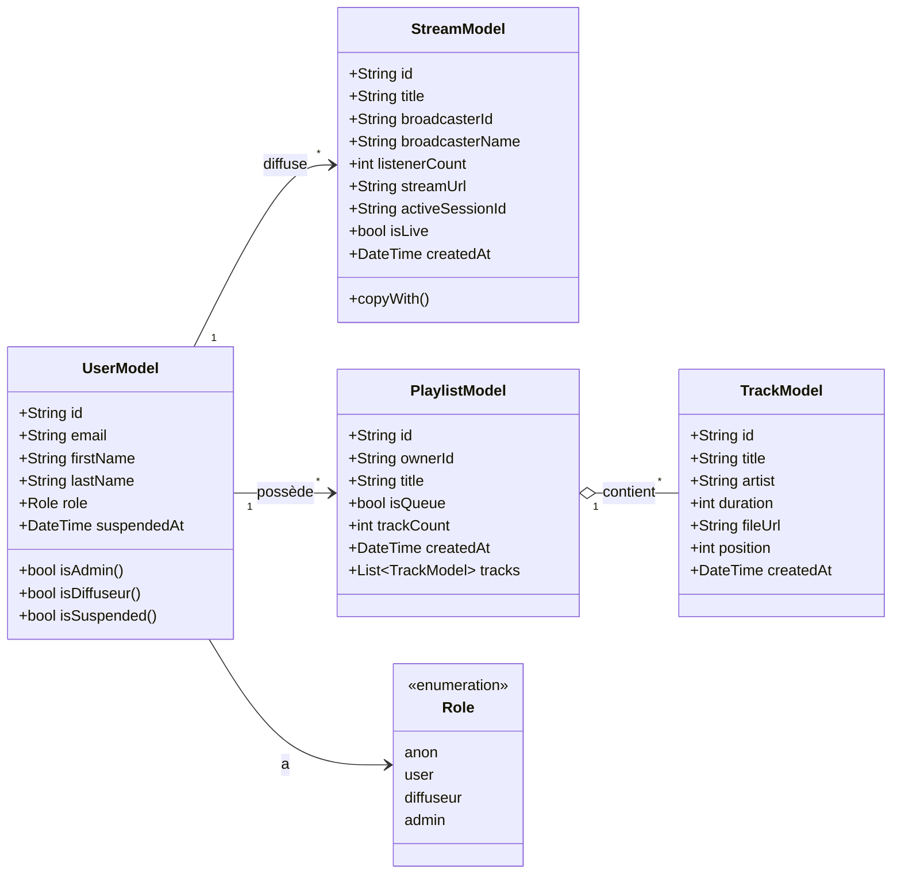
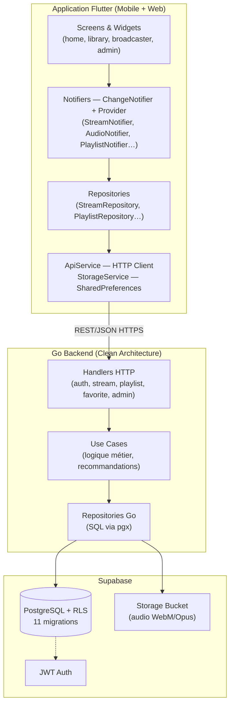
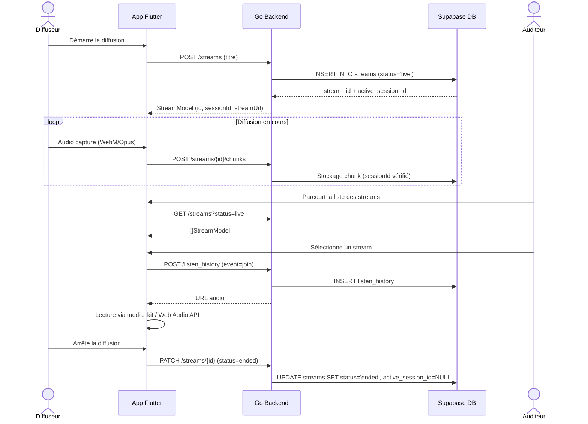
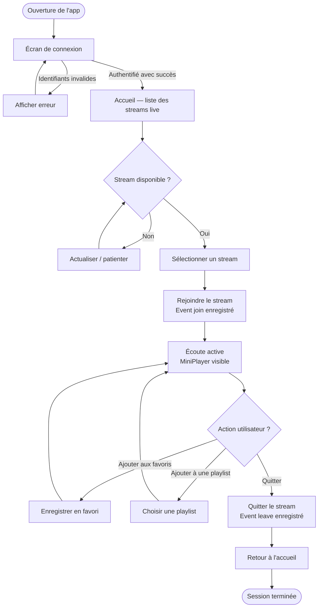

# Schémas UML & BPMN (Ce3.6.1)

Représentation de l'architecture, des modèles de données et des processus métier de
StreamPulse — plateforme de streaming audio live développée en Flutter (mobile et web),
Go (backend) et Supabase (PostgreSQL).

## 1. Diagramme de classes — Modèles Flutter

Source : `flutter/lib/api/models/`

Les modèles Flutter correspondent aux entités retournées par l'API Go. `TrackModel`
est utilisé pour les items de playlist et de favoris, qui référencent des streams
depuis la migration 011.

## 2. Diagramme de composants — Architecture globale

Le backend Go adopte une architecture clean plate : Handlers → Use Cases → Repositories →
Entités. L'application Flutter suit le même principe : Widgets → Notifiers (Provider) →
Repositories → ApiService.

## 3. Diagramme de séquence — Cycle de vie d'un stream

`active_session_id` est un UUID renouvelé à chaque diffusion : il empêche les chunks
d'une session précédente de corrompre la diffusion en cours (migration 010).

## 4. BPMN — Parcours utilisateur : écouter un stream

Les événements `join` et `leave` sont enregistrés dans `listen_history` pour alimenter
le moteur de recommandations (US-025).
