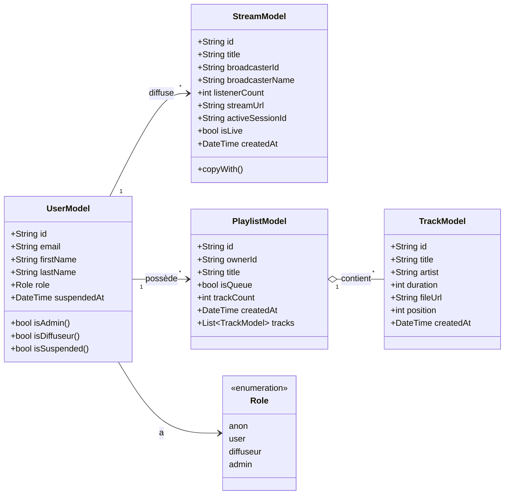
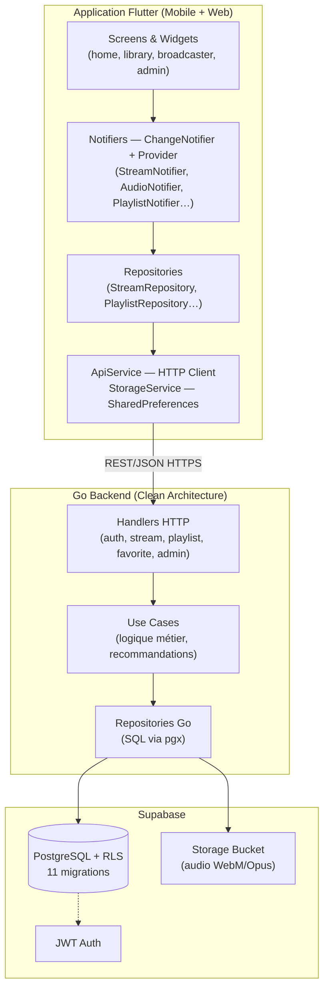
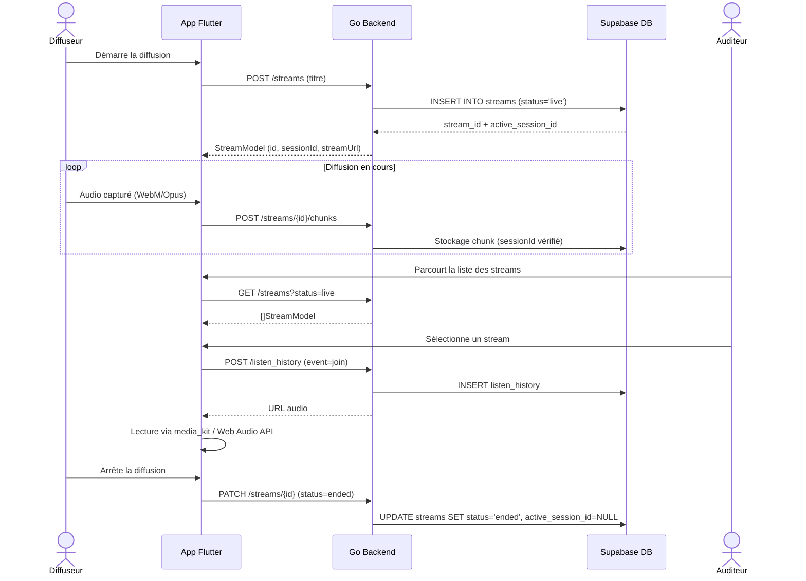
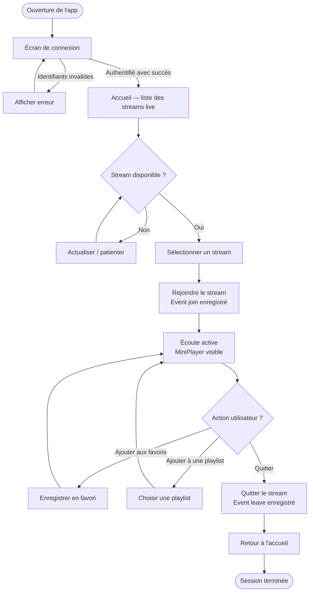
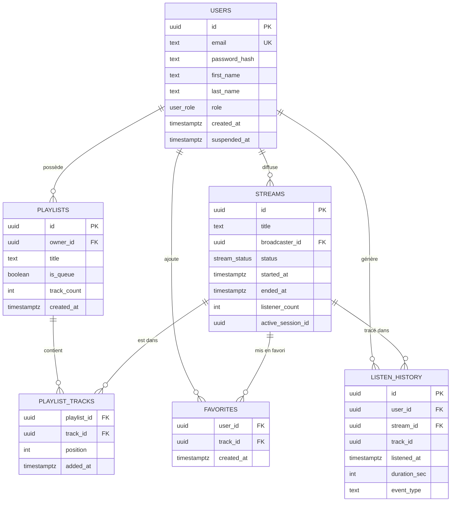

# Cahier des charges — StreamPulse

## 1. Présentation du projet

### 1.1 Contexte

StreamPulse est une plateforme de streaming audio en direct développée dans le cadre du
projet PEC2. Elle permet à des utilisateurs de diffuser en live depuis un microphone et
à des auditeurs d'écouter ces diffusions en temps réel depuis un navigateur web ou une
application mobile (iOS et Android).

Le projet couvre l'intégralité de la chaîne : backend API Go, application Flutter
multiplateforme, base de données PostgreSQL avec politiques de sécurité par ligne (RLS),
pipeline CI/CD, déploiement HTTPS sur Render et observabilité Prometheus/Grafana.

### 1.2 Objectifs

- Diffuser un flux audio en temps réel d'un émetteur vers plusieurs auditeurs.
- Gérer les comptes utilisateurs avec des rôles distincts (auditeur, diffuseur, admin).
- Permettre à chaque utilisateur de construire une bibliothèque personnelle (favoris,
  playlists).
- Alimenter un moteur de recommandations basé sur l'historique d'écoute.
- Respecter les exigences RGPD sur la collecte et la conservation des données.
- Assurer une fluidité d'interface à 60 FPS et une capacité à 500 auditeurs simultanés.

### 1.3 Périmètre

| Inclus | Hors périmètre |
| --- | --- |
| Streaming audio live WebM/Opus | Podcasts / fichiers pré-enregistrés |
| Application Flutter web + mobile (iOS, Android) | Application desktop native |
| API REST Go avec OpenAPI documenté | API GraphQL ou WebSocket temps réel |
| Gestion des comptes et rôles | Monétisation / paiement |
| Bibliothèque : favoris et playlists | Partage social externe |
| Moteur de recommandations | Algorithme ML avancé |
| Observabilité Prometheus / Grafana | APM cloud tiers payant |
| Déploiement Render + Docker Hub | Déploiement Kubernetes multi-région |

---

## 2. Acteurs et rôles

| Rôle | Description | Droits principaux |
| --- | --- | --- |
| **Anonyme** | Visiteur non authentifié | Inscription uniquement |
| **Auditeur** (`user`) | Utilisateur inscrit | Écouter les streams, gérer favoris et playlists |
| **Diffuseur** (`diffuseur`) | Auditeur avec droit de diffusion | Créer, démarrer, arrêter et supprimer ses streams |
| **Administrateur** (`admin`) | Gestionnaire de la plateforme | Tous les droits + gestion des comptes et statistiques |

Les rôles sont stockés dans la table `users.role` (ENUM PostgreSQL) et vérifiés à chaque
requête par le middleware RBAC du backend Go.

---

## 3. Spécifications fonctionnelles

### 3.1 Gestion des comptes

| Fonctionnalité | Description | Rôle |
| --- | --- | --- |
| Inscription | Créer un compte avec email, prénom, nom et mot de passe | Anonyme |
| Connexion | S'authentifier et recevoir un JWT RS256 | Tous |
| Déconnexion | Invalider la session côté client | Tous connectés |
| Consulter son profil | Accéder à ses informations de compte | Tous connectés |
| Modifier son mot de passe | Mettre à jour le mot de passe hashé | Tous connectés |

### 3.2 Diffusion live

| Fonctionnalité | Description | Rôle |
| --- | --- | --- |
| Créer un stream | Déclarer un nouveau canal de diffusion avec un titre | Diffuseur |
| Démarrer la diffusion | Activer le stream et envoyer les chunks audio (WebM/Opus) | Diffuseur |
| Arrêter la diffusion | Mettre fin au live (`status = ended`) | Diffuseur |
| Reprendre un stream | Réactiver un canal existant avec un nouvel `active_session_id` | Diffuseur |
| Supprimer un stream | Effacer définitivement un canal de diffusion | Diffuseur |
| Voir ses streams | Consulter la liste de ses canaux passés et actifs | Diffuseur |

Le protocole audio :

1. Le diffuseur crée un stream via `POST /api/v1/streams`.
2. Il envoie les blobs WebM/Opus de `MediaRecorder` vers `POST /api/v1/streams/{id}/push`
   (clients continus : `PUT /api/v1/streams/{id}/audio`).
3. Les auditeurs consomment `GET /api/v1/streams/{id}/audio` via une réponse HTTP
   incrémentale injectée dans l'API `MediaSource`.
4. L'arrêt via `PUT /api/v1/streams/{id}/stop` ou une déconnexion TCP libère les
   ressources (goroutines, channels, compteurs).

### 3.3 Écoute

| Fonctionnalité | Description | Rôle |
| --- | --- | --- |
| Lister les streams actifs | Voir tous les streams en cours sur l'écran d'accueil | Tous connectés |
| Rejoindre un stream | Lancer la lecture d'un live (event `join` enregistré) | Auditeur |
| Quitter un stream | Arrêter la lecture (event `leave` enregistré) | Auditeur |
| Contrôles de lecture | Lecture / pause / volume / arrêt | Auditeur |
| MiniPlayer persistant | Lecteur réduit visible en navigation entre écrans | Auditeur |

### 3.4 Bibliothèque personnelle

| Fonctionnalité | Description | Rôle |
| --- | --- | --- |
| Ajouter aux favoris | Marquer un stream comme favori | Auditeur |
| Retirer des favoris | Supprimer un favori | Auditeur |
| Créer une playlist | Créer une playlist nommée | Auditeur |
| Ajouter à une playlist | Ajouter un stream à une playlist existante | Auditeur |
| Consulter la bibliothèque | Voir ses playlists et favoris | Auditeur |
| File de lecture (queue) | Playlist spéciale `is_queue = true` pour la lecture enchaînée | Auditeur |

### 3.5 Recommandations

| Fonctionnalité | Description | Rôle |
| --- | --- | --- |
| Streams suggérés | Proposer des streams basés sur l'historique d'écoute | Auditeur |

L'historique est alimenté par les events `join` et `leave` dans `listen_history`.
Le moteur filtre les streams déjà écoutés et favorise les diffuseurs fréquents.

### 3.6 Administration

| Fonctionnalité | Description | Rôle |
| --- | --- | --- |
| Lister les utilisateurs | Voir tous les comptes avec leur rôle et leur statut | Admin |
| Modifier le rôle d'un compte | Passer un compte de `user` à `diffuseur` ou inversement | Admin |
| Suspendre un compte | Bloquer un utilisateur (`suspended_at` non null) | Admin |
| Réactiver un compte | Lever une suspension | Admin |
| Statistiques plateforme | Nombre d'utilisateurs, streams actifs, historique global | Admin |

---

## 4. Architecture technique

### 4.1 Stack

| Couche | Technologie | Version |
| --- | --- | --- |
| Application mobile et web | Flutter | 3.48+ (channel beta) |
| Backend API | Go, Clean Architecture | 1.26 |
| Base de données | PostgreSQL (Supabase) | 15 |
| Authentification | JWT RS256 | — |
| Stockage fichiers | Supabase Storage (bucket audio) | — |
| Observabilité | Prometheus + Grafana | — |
| CI/CD | GitHub Actions | — |
| Hébergement | Render (API) + Docker Hub (image) | — |

### 4.2 Organisation du code

```
streaming/
├── go/                        Backend Go (Clean Architecture)
│   ├── cmd/server/            Point d'entrée, configuration
│   ├── internal/
│   │   ├── entity/            Entités métier (User, Stream, Playlist…)
│   │   ├── usecase/           Logique applicative
│   │   ├── repository/        Accès base de données (pgx)
│   │   ├── handler/           Handlers HTTP (Gin)
│   │   └── handler/middleware/ CORS, Auth, RBAC
│   └── docs/openapi/          Spécification OpenAPI générée
├── flutter/
│   └── lib/
│       ├── api/models/        Modèles de données Flutter
│       ├── api/repositories/  Accès à l'ApiService
│       ├── notifiers/         État global (Provider + ChangeNotifier)
│       ├── screens/           Écrans de l'application
│       ├── widgets/           Composants réutilisables
│       └── config/            Router, thème, configuration
├── migrations/                11 migrations SQL séquentielles
└── docs/                      Documentation technique
```

### 4.3 Décisions architecturales (ADR)

| ADR | Décision | Justification |
| --- | --- | --- |
| ADR-001 | Gin (net/http) plutôt qu'un framework lourd | Performance, contrôle total du routage |
| ADR-002 | Clean Architecture plate | Séparation des responsabilités sans sur-ingénierie |
| ADR-003 | Supabase (PostgreSQL + RLS) | BDD managée avec isolation des données en base |
| ADR-006 | Provider + ChangeNotifier (Flutter) | Gestion d'état simple et testable sans Riverpod |
| ADR-007 | HTTP chunked streaming (WebM/Opus) | Pas de dépendance à un CDN ou un serveur média tiers |
| ADR-008 | media_kit (iOS/Android) + Web Audio API | Décodage natif WebM/Opus multiplateforme |

---

## 5. Schémas UML & BPMN (Ce3.6.1)

Représentation de l'architecture, des modèles de données et des processus métier de
StreamPulse.

### 5.1 Diagramme de classes — Modèles Flutter

Source : `flutter/lib/api/models/`



Les modèles Flutter correspondent aux entités retournées par l'API Go. `TrackModel`
est utilisé pour les items de playlist et de favoris, qui référencent des streams
depuis la migration 011.

### 5.2 Diagramme de composants — Architecture globale



Le backend Go adopte une architecture clean plate : Handlers → Use Cases → Repositories →
Entités. L'application Flutter suit le même principe : Widgets → Notifiers (Provider) →
Repositories → ApiService.

### 5.3 Diagramme de séquence — Cycle de vie d'un stream



`active_session_id` est un UUID renouvelé à chaque diffusion : il empêche les chunks
d'une session précédente de corrompre la diffusion en cours (migration 010).

### 5.4 BPMN — Parcours utilisateur : écouter un stream



Les événements `join` et `leave` sont enregistrés dans `listen_history` pour alimenter
le moteur de recommandations.

---

## 6. Schéma de base de données (MCD / MPD)

Base de données PostgreSQL hébergée sur Supabase. Le schéma est défini par 11 migrations
appliquées séquentiellement (`migrations/001_init.sql` → `migrations/011_favorites_playlists_reference_streams.sql`).

### 6.1 MCD — Entités et relations



Depuis la migration 011, `favorites.track_id` et `playlist_tracks.track_id` référencent
`streams(id)` et non `tracks(id)` — dans StreamPulse le contenu favori/playlistable est
un stream live.

### 6.2 MPD — Tables et colonnes

#### Table `users` — Comptes utilisateurs (RLS activé)

| Colonne | Type | Contrainte | Description |
| --- | --- | --- | --- |
| `id` | UUID | PK · DEFAULT gen_random_uuid() | Identifiant unique |
| `email` | TEXT | UNIQUE · NOT NULL | Adresse email (identifiant de connexion) |
| `password_hash` | TEXT | NOT NULL | Hash bcrypt — jamais exposé via l'API |
| `first_name` | TEXT | NOT NULL DEFAULT '' | Prénom affiché sur les streams |
| `last_name` | TEXT | NOT NULL DEFAULT '' | Nom de famille |
| `role` | user_role | NOT NULL DEFAULT 'user' | ENUM : anon · user · diffuseur · admin |
| `created_at` | TIMESTAMPTZ | NOT NULL DEFAULT NOW() | Date de création du compte |
| `suspended_at` | TIMESTAMPTZ | NULL | Date de suspension (migration 006) — null = actif |

#### Table `streams` — Diffusions live (RLS activé)

| Colonne | Type | Contrainte | Description |
| --- | --- | --- | --- |
| `id` | UUID | PK | Identifiant du stream (canal réutilisable) |
| `title` | TEXT | NOT NULL | Titre de la diffusion |
| `broadcaster_id` | UUID | FK → users(id) CASCADE | Diffuseur |
| `status` | stream_status | NOT NULL DEFAULT 'live' | ENUM : live · ended |
| `started_at` | TIMESTAMPTZ | NOT NULL DEFAULT NOW() | Début de la diffusion |
| `ended_at` | TIMESTAMPTZ | NULL | Fin de la diffusion |
| `listener_count` | INT | NOT NULL DEFAULT 0 | Nombre d'auditeurs en temps réel |
| `active_session_id` | UUID | NULL · CHECK cohérence | UUID de session renouvelé à chaque live (migration 010) |

#### Table `playlists` — Bibliothèques personnelles (RLS activé)

| Colonne | Type | Contrainte | Description |
| --- | --- | --- | --- |
| `id` | UUID | PK | Identifiant de la playlist |
| `owner_id` | UUID | FK → users(id) CASCADE | Propriétaire |
| `title` | TEXT | NOT NULL | Nom de la playlist |
| `is_queue` | BOOLEAN | NOT NULL DEFAULT FALSE | true = file de lecture automatique |
| `track_count` | INT | NOT NULL DEFAULT 0 | Dénormalisé — maintenu par trigger (migration 005) |
| `created_at` | TIMESTAMPTZ | NOT NULL DEFAULT NOW() | Date de création |

#### Table `playlist_tracks` — Items de playlist

| Colonne | Type | Contrainte | Description |
| --- | --- | --- | --- |
| `playlist_id` | UUID | PK · FK → playlists(id) CASCADE | Playlist parente |
| `track_id` | UUID | PK · FK → streams(id) CASCADE | Stream ajouté (réf. streams depuis migration 011) |
| `position` | INT | NOT NULL | Ordre dans la playlist |
| `added_at` | TIMESTAMPTZ | NOT NULL DEFAULT NOW() | Date d'ajout |

#### Table `favorites` — Streams mis en favori

| Colonne | Type | Contrainte | Description |
| --- | --- | --- | --- |
| `user_id` | UUID | PK · FK → users(id) CASCADE | Utilisateur |
| `track_id` | UUID | PK · FK → streams(id) CASCADE | Stream mis en favori (réf. streams depuis migration 011) |
| `created_at` | TIMESTAMPTZ | NOT NULL DEFAULT NOW() | Date d'ajout aux favoris |

#### Table `listen_history` — Historique d'écoute (RLS activé)

| Colonne | Type | Contrainte | Description |
| --- | --- | --- | --- |
| `id` | UUID | PK · DEFAULT gen_random_uuid() | Clé surrogate (migration 008) |
| `user_id` | UUID | FK → users(id) CASCADE | Auditeur |
| `stream_id` | UUID | FK → streams(id) SET NULL | Stream écouté |
| `track_id` | UUID | NULL | Référence optionnelle à un track |
| `listened_at` | TIMESTAMPTZ | NOT NULL DEFAULT NOW() | Horodatage de l'événement |
| `duration_sec` | INT | NOT NULL DEFAULT 0 | Durée d'écoute en secondes |
| `event_type` | TEXT | CHECK IN ('join','leave') | Type d'événement — migration 009 |

### 6.3 Notes importantes

**Trigger `trg_playlist_track_count`** (migration 005) — Ce trigger PostgreSQL maintient
`playlists.track_count` à jour après chaque INSERT ou DELETE sur `playlist_tracks`,
évitant un COUNT(*) coûteux à chaque lecture de playlist.

**Row Level Security** — Toutes les tables sensibles ont RLS activé. Chaque utilisateur
n'accède qu'à ses propres données. Les streams sont publics en lecture (`FOR SELECT USING (TRUE)`).
Les admins disposent de policies dédiées avec vérification du rôle en base.

---

## 7. Protection des données personnelles — RGPD (Ce3.1.4)

StreamPulse collecte uniquement les données strictement nécessaires à son fonctionnement,
conformément au Règlement Général sur la Protection des Données (RGPD — UE 2016/679).

### 7.1 Données collectées, finalités et base légale

| Donnée | Finalité | Base légale | Conservation |
| --- | --- | --- | --- |
| Email | Identification et authentification du compte | Consentement (inscription) | Jusqu'à suppression du compte |
| Prénom, nom | Affichage du nom du diffuseur sur les streams | Consentement (inscription) | Jusqu'à suppression du compte |
| Mot de passe (hash bcrypt) | Authentification sécurisée — jamais stocké en clair | Exécution du contrat | Jusqu'à suppression du compte |
| Rôle utilisateur | Contrôle d'accès aux fonctionnalités (user / diffuseur / admin) | Intérêt légitime | Jusqu'à suppression du compte |
| Statut de suspension | Gestion des abus et sécurité de la plateforme | Intérêt légitime | Jusqu'à levée de la suspension |
| Historique d'écoute | Moteur de recommandation personnalisé | Consentement (action volontaire de rejoindre un stream) | Supprimé en cascade à la suppression du compte |
| Favoris et playlists | Bibliothèque personnelle de l'utilisateur | Consentement | Supprimé en cascade à la suppression du compte |
| Métadonnées de diffusion | Titre du stream, nombre d'auditeurs, horodatage | Exécution du contrat | Archivé après la fin du stream |

### 7.2 Recueil du consentement

**Inscription** — L'utilisateur fournit explicitement son email, prénom, nom et mot de passe.
La validation du formulaire constitue un consentement libre, spécifique et éclairé au
traitement des données d'identification.

**Historique d'écoute** — La collecte est déclenchée par l'action volontaire de rejoindre
un stream (event `join`). L'utilisateur peut quitter à tout moment (event `leave`).
Aucun tracking passif n'est effectué.

### 7.3 Mesures de sécurité technique

- Hachage bcrypt des mots de passe
- Authentification par JWT (tokens signés RS256)
- HTTPS sur toutes les communications
- Row Level Security (RLS) Supabase : chaque utilisateur n'accède qu'à ses propres données
- Suppression en cascade (`ON DELETE CASCADE`) : la suppression d'un compte efface
  automatiquement l'historique, les favoris, les playlists et les streams associés
- Accès admin via rôle vérifié en base de données (policy RLS dédiée)

**Row Level Security (RLS)** — Chaque politique RLS garantit qu'un utilisateur authentifié
ne peut lire et modifier que ses propres données, indépendamment des requêtes applicatives.
Les administrateurs disposent de policies séparées avec vérification du rôle en base.

### 7.4 Droits des utilisateurs

| Article | Droit | Application dans StreamPulse |
| --- | --- | --- |
| Art. 15 | Accès | Données consultables via les écrans Profil et Bibliothèque de l'application |
| Art. 16 | Rectification | Prénom, nom et mot de passe modifiables depuis les paramètres du compte |
| Art. 17 | Effacement (droit à l'oubli) | Suppression du compte → suppression en cascade de toutes les données associées |
| Art. 18 | Limitation | Aucun traitement automatique en arrière-plan sans action explicite de l'utilisateur |
| Art. 20 | Portabilité | L'API expose les données au format JSON standardisé, exportable à la demande |
| Art. 21 | Opposition | L'utilisateur peut ne pas rejoindre les streams pour éviter toute collecte d'historique |

---

## 8. Contraintes techniques, performance et coûts

### 8.1 Contraintes de performance

| Contrainte | Valeur cible | Mesure |
| --- | --- | --- |
| Fluidité UI | 60 FPS (p90 fil UI ≤ 16,67 ms) | Test Flutter en mode profile |
| Capacité streaming | 500 auditeurs simultanés | Benchmark Go hub fan-out |
| Latence API | p95 < 500 ms | Alerte Prometheus `StreamPulseHighLatencyP95` |
| Taux d'erreur | 5xx < 5 % | Alerte Prometheus `StreamPulseHigh5xxRate` |
| Drops audio | < 1 % de chunks abandonnés | Alerte `StreamPulseAudioDrops` |
| Allocation mémoire | 1 clone 32 Kio par chunk (non proportionnel au nombre d'auditeurs) | pprof Go |

### 8.2 Résultats de benchmark Hub fan-out

Mesure effectuée avec Go 1.25, Windows amd64, Intel Core i7-7660U 2,50 GHz (4 threads) :

```bash
go test ./internal/infrastructure/streaming \
  -run '^$' -bench '^BenchmarkHubBroadcast$' \
  -benchmem -benchtime=2s
```

| Auditeurs | Temps/chunk 32 Kio | Débit logique | Mémoire/op | Allocations/op |
| ---: | ---: | ---: | ---: | ---: |
| 10 | 13 774 µs | 23,790 MB/s | 32 768 o | 1 |
| 100 | 19 213 µs | 170,548 MB/s | 32 768 o | 1 |
| 500 | 43 718 µs | 374,766 MB/s | 32 768 o | 1 |

Le débit est « logique » : Go compte les octets remis aux 500 channels, pas les
octets réellement sortis de la carte réseau. La preuve importante est
l'allocation constante : un seul clone immuable de 32 Kio par chunk, et non un
clone par auditeur.

### 8.3 Résultats k6 (charge réelle)

Exécution réelle le 9 août 2026 sur le binaire Go instrumenté local, Windows amd64,
Go 1.26.1, k6 2.1.0 :

| Palier | Source | CPU p95 (% d'un cœur) | RSS max | Drops | Checks k6 | Requêtes échouées |
| ---: | ---: | ---: | ---: | ---: | ---: | ---: |
| 10 | 127,66 kbit/s | 6,06 % | 35,47 Mio | 0 % | 100 % | 0 % |
| 100 | 128,73 kbit/s | 10,08 % | 42,75 Mio | 0 % | 100 % | 0 % |
| 500 | 129,66 kbit/s | 27,23 % | 74,31 Mio | 0 % | 100 % | 0 % |

Les trois paliers satisfont les seuils (0 % de drops, 100 % de checks k6, 0 % d'échecs).

### 8.4 Budget réseau

Pour un encodage constant à 128 kbit/s :

| Auditeurs simultanés | Sortie requise | Données pour 1 h | Données si 24/7 pendant 30 j |
| ---: | ---: | ---: | ---: |
| 10 | 1,28 Mbit/s | 576 Mo | 0,415 To |
| 100 | 12,8 Mbit/s | 5,76 Go | 4,15 To |
| 500 | 64 Mbit/s | 28,8 Go | 20,74 To |

Une marge de 30 % est réservée au TLS, aux retransmissions et aux autres services.
Avec une interface à 200 Mbit/s, le budget utile est 140 Mbit/s, soit environ
1 093 auditeurs à 128 kbit/s. Cette limite réseau arrive avant la limite du fan-out.

### 8.5 Comparatif de coût self-hosted

Exemple indicatif en région Paris (prix publics Scaleway, juillet 2026, hors taxes) :

| Poste | Hypothèse | Coût mensuel |
| --- | --- | ---: |
| VM | Scaleway BASIC2-A2C-4G, 2 vCPU, 4 Gio, 200 Mbit/s | 16,79 € |
| IPv4 flexible | 0,004 €/h × 730 h | 2,92 € |
| Block Storage 5K | 40 Gio × 0,000130 €/Gio/h × 730 h | 3,80 € |
| API/Prometheus/Grafana | Conteneurs sur la même VM | inclus compute |
| **Total infrastructure** | hors BDD/Supabase, sauvegardes et TVA | **23,51 €** |

La production utilise Render ; son coût réel doit être relevé dans le dashboard Render.

### 8.6 Seuils de décision opérationnels

- Drops audio > 1 % pendant 2 min : incident, vérifier clients lents et CPU
- Bande passante > 70 % soutenue : augmenter la capacité avant le palier suivant
- Heap ou goroutines ne revenant pas au niveau de repos : suspicion de fuite
- CPU > 70 % soutenu : profiler avant de scaler
- Une seconde réplique n'est pas sûre sans routage par `stream_id` (Hub non distribué)

### 8.7 Sécurité

- **Authentification** : JWT RS256 (clé privée 4096 bits, jamais commitée).
- **Autorisation** : middleware RBAC Go vérifiant le rôle à chaque handler protégé.
- **Isolation données** : Row Level Security Supabase sur toutes les tables sensibles.
- **Mots de passe** : hachage bcrypt, jamais exposés en clair ni via l'API.
- **Transport** : HTTPS obligatoire en production, géré par Render.
- **Métriques** : endpoint `/metrics` protégé par bearer token.
- **Profiling** : pprof (`/debug/pprof/`) désactivé en production.

### 8.8 Accessibilité

Les widgets interactifs (`StreamCard`, `MiniPlayer`, `AudioControls`) sont annotés avec
`Semantics` Flutter pour la compatibilité avec les lecteurs d'écran (TalkBack, VoiceOver).

---

## 9. Infrastructure et déploiement

### 9.1 Environnements

| Environnement | URL | Backend | Base de données |
| --- | --- | --- | --- |
| Local | `http://localhost:8080` | Docker Compose | Supabase cloud ou local |
| Production | `https://streampulse-api-1jxg.onrender.com` | Render Web Service | Supabase cloud |

### 9.2 Pipeline CI/CD (GitHub Actions)

Le workflow `.github/workflows/deploy.yml` suit cet ordre :

```
push main
  → tests Go (race detector, couverture)
  → tests Flutter (unit + widget)
  → build Flutter Web
  → vérification contrat OpenAPI
  → build go/Dockerfile (multi-stage distroless)
  → push Docker Hub :<SHA Git>
  → push Docker Hub :latest
  → POST API Render avec docker.io/...:<SHA Git>
  → attendre le statut live
  → résoudre et comparer le digest manifeste Linux/amd64
  → prouver health, endpoint métier public, redirection HTTP et certificat TLS
  → en cas d'échec critique, rollback automatique vers la version précédente
  → prouver Prometheus, Loki et Tempo (sans rollback sur erreur de lecture)
  → publier l'artefact production-evidence-<SHA Git>
```

Le job Render dépend du job Docker Hub : l'API Render n'est jamais appelée si les tests,
le build ou le push échouent.

### 9.3 Créer le Web Service Render

Dans Render, créer un Web Service à partir d'une image existante :

```
docker.io/mon-compte/streampulse-api:<sha-git>
```

Configuration requise :

- Health check : `/health`
- Auto-deploy Render : désactivé (GitHub Actions déploie le tag SHA exact)
- Une seule instance (Hub audio en mémoire non distribué)
- Région proche de la base PostgreSQL/Supabase

### 9.4 Variables et secrets

Jamais commitées. Configurées dans GitHub (Secrets/Variables) et Render (Environment) :

| Nom | Usage |
| --- | --- |
| `JWT_PRIVATE_KEY_PATH` / `JWT_PUBLIC_KEY_PATH` | Clés RS256 (Secret Files Render) |
| `SUPABASE_DB_URL` | Chaîne de connexion PostgreSQL avec `sslmode=require` |
| `CORS_ALLOWED_ORIGINS` | Origines autorisées (exact match) |
| `METRICS_BEARER_TOKEN` | Protection de `/metrics` |
| `DOCKERHUB_USERNAME` / `DOCKERHUB_TOKEN` | Publication image Docker Hub |
| `RENDER_SERVICE_ID` / `RENDER_API_KEY` | Déploiement et rollback via l'API Render |

Génération des clés RS256 :

```bash
openssl genrsa -out private.pem 4096
openssl rsa -in private.pem -pubout -out public.pem
```

Ne jamais committer `private.pem` ni `public.pem`.

### 9.5 HTTPS et domaine

L'URL `onrender.com` fournie par Render est disponible en HTTPS. Pour un domaine
personnalisé : ajouter le domaine dans Render, créer les enregistrements DNS,
attendre la validation du certificat, puis mettre à jour `CORS_ALLOWED_ORIGINS`.

Vérification :

```bash
curl --fail --show-error https://streampulse-api.onrender.com/health
curl -I http://streampulse-api.onrender.com/health
```

Résultats attendus : `/health` renvoie 200 en HTTPS, et HTTP redirige vers HTTPS.

### 9.6 Rollback

Chaque version reste disponible sur Docker Hub avec son SHA Git. Le workflow manuel
`Render rollback proof` mémorise la version active, appelle l'API Render de rollback,
prouve le digest et TLS, redéploie la version précédente et publie les deux artefacts.

---

## 10. Observabilité

### 10.1 Dashboard Grafana

Dashboard : `StreamPulse - RNCP Observability`
Fichier source : `go/infra/grafana/dashboards/streampulse.json`

En local, Docker Compose provisionne automatiquement le datasource Prometheus et le
dashboard. Dans Grafana Cloud, importer le JSON et créer un datasource Prometheus
compatible. Alertes à reprendre depuis `go/infra/prometheus/alerts.yml`.

**Panels métier :**
- Online users : `streampulse_online_users`
- Active streams : `streampulse_active_streams`
- Total listeners : `sum(streampulse_listeners_per_stream)`
- Stream starts — last hour
- Listeners by stream
- Audience et streams actifs dans le temps

**Panels audio réels :**
- Audio ingest bitrate / egress bitrate par stream
- Dropped audio chunks (backpressure clients lents)
- Connected audio publishers / real audio bitrate
- Audio health (chunks livrés vs abandonnés)

**Panels techniques :**
- API latency p50 / p95 / p99
- 5xx error rate / Requests per second by status
- Slowest API routes p95

### 10.2 Métriques exposées

L'API expose les métriques Prometheus sur `/metrics`, protégé par bearer token.

| Métrique | Type | Usage |
| --- | --- | --- |
| `streampulse_online_users` | Gauge | Utilisateurs uniques connectés à un stream |
| `streampulse_active_streams` | Gauge | Streams live en cours |
| `streampulse_listeners_per_stream{stream_id}` | Gauge | Listeners actifs par stream |
| `streampulse_stream_start_total` | Counter | Nombre total de streams démarrés |
| `streampulse_listener_disconnect_total` | Counter | Nombre total de déconnexions listeners |
| `streampulse_audio_ingest_bytes_total{stream_id}` | Counter | Octets reçus du diffuseur |
| `streampulse_audio_egress_bytes_total{stream_id}` | Counter | Octets écrits aux auditeurs HTTP |
| `streampulse_audio_dropped_chunks_total{stream_id}` | Counter | Chunks abandonnés (clients lents) |
| `streampulse_api_request_duration_seconds` | Histogram | Latence HTTP par route/méthode/status |

### 10.3 Alertes Prometheus

Règles dans `go/infra/prometheus/alerts.yml` :

| Alerte | Seuil |
| --- | --- |
| `StreamPulseHigh5xxRate` | Taux 5xx > 5 % pendant 5 minutes |
| `StreamPulseHighLatencyP95` | Latence p95 > 500 ms pendant 5 minutes |
| `StreamPulseDisconnectSpike` | Plus de 20 déconnexions listeners/minute pendant 5 min |
| `StreamPulseAudioDrops` | Plus de 1 % de chunks audio abandonnés pendant 2 minutes |
| `StreamPulsePublisherWithoutListeners` | Source connectée sans auditeur pendant 10 minutes |

### 10.4 Collecte en production (Render + Grafana Cloud)

Le Web Service API exporte directement les métriques et les traces en OTLP vers
Grafana Cloud (`OTEL_EXPORTER_OTLP_ENDPOINT`, `OTEL_EXPORTER_OTLP_PROTOCOL=http/protobuf`).
Les logs partent directement vers Loki. `/metrics` reste disponible pour la stack locale.

---

## 11. Cycle de vie du streaming audio

### 11.1 Routes et protocole

Le plan de données audio utilise HTTP derrière le reverse proxy HTTPS Render :

| Route | Rôle |
| --- | --- |
| `POST /api/v1/streams/:id/push` | Reçoit les blobs WebM/Opus de `MediaRecorder` (4 Mio max/blob) |
| `PUT /api/v1/streams/:id/audio` | Corps continu pour FFmpeg et producteurs non-Web |
| `GET /api/v1/streams/:id/audio/ws` | Envoie à Flutter Web les octets WebM ordonnés via WebSocket |
| `GET /api/v1/streams/:id/audio` | Flux HTTP public de secours |
| `GET /api/v1/streams/:id/listen` | Variante authentifiée non-Web |

### 11.2 Live réutilisable et sessions isolées

La ligne `streams` représente un live persistant que son diffuseur peut reprendre
avec le même identifiant. L'`active_session_id` est renouvelé à chaque création
ou reprise, ce qui isole chaque session audio.

Un chunk retardé qui avait déjà passé le contrôle BDD ne peut pas rouvrir le flux
après un arrêt. Un `Stop` retardé d'un ancien onglet ne peut pas arrêter une reprise.

### 11.3 Propagation de l'annulation

| Événement | Effet |
| --- | --- |
| Auditeur ferme la connexion | `Request.Context()` annulé, client retiré du Hub, channel fermé, leave BDD exécuté avec contexte détaché borné |
| Diffuseur ferme le corps PUT | EOF ferme le publisher et observe la durée de session |
| Diffuseur Web arrête | Dernier blob vidé, `/stop` ferme le publisher chunké et tous les auditeurs |
| Stream arrêté | `Hub.CloseStream` annule l'ingestion et ferme tous les channels auditeurs |
| SIGINT/SIGTERM | Contexte racine annulé, Hub fermé avant `http.Server.Shutdown` |
| Client lent | Son channel borné ne bloque jamais le diffuseur ; connexion fermée et reconstruite |
| BDD lente après déconnexion | Leave avec timeout de 3 s — ne retient pas la connexion audio |

### 11.4 Matrice des limites

| Variable | Défaut | Protection |
| --- | ---: | --- |
| `HTTP_READ_HEADER_TIMEOUT` | 10 s | Slowloris sur les en-têtes |
| `HTTP_IDLE_TIMEOUT` | 60 s | Connexions keep-alive HTTP inactives |
| `STREAM_MAX_DURATION` | 6 h | Ingestion infinie ou oubliée |
| `STREAM_IDLE_TIMEOUT` | 30 s | Diffuseur silencieux |
| `STREAM_WRITE_TIMEOUT` | 10 s | Socket auditeur bloqué |
| `STREAM_MAX_INGEST_BYTES` | 8 Gio | Volume maximal par requête d'ingestion |
| `STREAM_CHUNK_SIZE` | 32 Kio | Allocation de lecture bornée |
| `STREAM_CLIENT_BUFFER` | 64 chunks | Mémoire et backpressure bornées par client |
| `SHUTDOWN_TIMEOUT` | 30 s | Durée maximale d'arrêt gracieux |

### 11.5 Limites connues

Le Hub est en mémoire : une réplique API ne partage pas ses publishers avec une autre.
En production mono-nœud, c'est cohérent et simple. Un déploiement multi-répliques
exigera une affinité `stream_id` ou un bus média externe (NATS/Redis Streams, WebRTC SFU).

---

## 12. Plan de formation utilisateurs

### 12.1 Publics concernés

| Rôle | Besoin principal | Fonctionnalités utilisées |
| --- | --- | --- |
| Auditeur | Écouter des streams en direct et gérer sa bibliothèque | Accueil, lecteur audio, inscription, connexion, playlists, favoris |
| Diffuseur | Créer et animer des lives audio | Studio, création de stream, démarrage, arrêt, reprise, suppression |
| Administrateur | Gérer les comptes et suivre les statistiques | Liste utilisateurs, rôles, suspension, réactivation, statistiques |

### 12.2 Organisation de la formation

La formation est prévue sur 1 h 30. Elle peut être réalisée en présentiel ou en
visioconférence avec partage d'écran.

| Séquence | Durée | Participants | Objectif |
| --- | ---: | --- | --- |
| Présentation générale | 10 min | Tous | Comprendre le rôle de StreamPulse et les règles de sécurité |
| Parcours auditeur | 25 min | Auditeurs, diffuseurs, admin | S'inscrire, se connecter, écouter, gérer playlists et favoris |
| Parcours diffuseur | 25 min | Diffuseurs, admin | Créer, démarrer, diffuser, arrêter et reprendre un live |
| Parcours admin | 20 min | Admin | Gérer les utilisateurs, rôles, suspensions et statistiques |
| Questions et validation | 10 min | Tous | Vérifier l'autonomie des utilisateurs |

### 12.3 Guide auditeur

**Se créer un compte** — Ouvrir StreamPulse, cliquer sur Inscription, choisir le rôle
Auditeur, renseigner prénom, nom, email et mot de passe, valider.

**Écouter un stream** — Depuis l'accueil, repérer un stream marqué `LIVE`, cliquer sur
le bouton de lecture, utiliser le lecteur pour mettre en pause ou arrêter l'écoute.

**Gérer sa bibliothèque** — Aller dans `Ma Bibliothèque`, ouvrir l'onglet `Playlists`
ou `Favoris`, créer, renommer, ajouter ou supprimer des éléments.

### 12.4 Guide diffuseur

**Accéder au studio** — Se connecter avec un compte `Diffuseur`, ouvrir l'onglet `Studio`,
vérifier que l'écran `Mon Studio` est visible.

**Créer et démarrer un live** — Saisir un titre, cliquer sur `Démarrer le live`, autoriser
l'accès au micro, vérifier que l'état passe à `EN DIRECT`.

**Bonnes pratiques** — Garder l'onglet ouvert pendant la diffusion, ne pas écouter le live
sur le même appareil sans casque, prévenir les auditeurs avant d'arrêter.

**Arrêter et reprendre** — `Arrêter le stream` met fin à la session audio. `Continuer ce live`
relance une nouvelle session sur le même canal. `Supprimer ce live` est définitif.

### 12.5 Guide administrateur

**Lister et contrôler les utilisateurs** — Ouvrir `Administration > Utilisateurs`,
vérifier email, nom, rôle et statut de chaque compte.

**Changer un rôle** — Menu utilisateur → `Changer le rôle` → choisir `Auditeur`,
`Diffuseur` ou `Administrateur` → confirmer. Attribuer le rôle admin uniquement à
une personne autorisée.

**Suspendre ou réactiver** — `Suspendre` bloque l'accès (badge `Suspendu` affiché).
`Réactiver` rend l'accès. Un compte suspendu ne peut plus se connecter.

### 12.6 Support et dépannage

| Problème | Cause probable | Action recommandée |
| --- | --- | --- |
| Connexion refusée | Email ou mot de passe incorrect | Vérifier les identifiants |
| Accès interdit | Rôle insuffisant | Demander le bon rôle à un administrateur |
| Aucun stream visible | Aucun live actif | Rafraîchir l'accueil |
| Micro non disponible | Permission navigateur refusée | Autoriser le micro dans les paramètres |
| Coupure audio | Réseau instable ou live arrêté | Vérifier la connexion, relancer la lecture |

### 12.7 Exercices de validation

| Rôle | Exercice | Critère de réussite |
| --- | --- | --- |
| Auditeur | Créer un compte, se connecter, écouter un live, créer une playlist | Parcours réalisé sans aide |
| Diffuseur | Créer un live, autoriser le micro, arrêter puis reprendre le live | Le live passe bien de `HORS LIGNE` à `EN DIRECT` |
| Administrateur | Changer un rôle, suspendre puis réactiver un compte de test | Badges et droits changent conformément à l'action |

---

## 13. Runbook — Environnement local

### 13.1 Prérequis

- Go 1.26+
- Docker Desktop ou Docker Engine avec Compose
- OpenSSL
- URL PostgreSQL/Supabase accessible pour `SUPABASE_DB_URL`

### 13.2 Bootstrap

**macOS/Linux :**

```bash
cp .env.example .env
mkdir -p secrets
openssl genrsa -out secrets/private.pem 4096
openssl rsa -in secrets/private.pem -pubout -out secrets/public.pem
openssl rand -hex 32 > secrets/metrics_bearer_token
```

**Windows PowerShell :**

```powershell
Copy-Item .env.example .env
New-Item -ItemType Directory -Force secrets
openssl genrsa -out secrets/private.pem 4096
openssl rsa -in secrets/private.pem -pubout -out secrets/public.pem
[guid]::NewGuid().ToString("N") | Set-Content -NoNewline secrets/metrics_bearer_token
```

Mettre à jour `.env` avec l'URL de base de données locale et les origines CORS.

### 13.3 Démarrer la stack

```bash
docker compose up -d --build
docker compose ps
```

Services disponibles :

| Service | URL |
| --- | --- |
| API | http://localhost:8080 |
| Prometheus | http://localhost:9090 |
| Grafana | http://localhost:3000 |
| pprof (loopback) | http://127.0.0.1:6060/debug/pprof/ |

### 13.4 Vérification santé et métriques

```bash
curl http://localhost:8080/health
token="$(cat secrets/metrics_bearer_token)"
curl -H "Authorization: Bearer ${token}" http://localhost:8080/metrics
```

Résultats attendus : `/health` retourne 200, `/metrics` sans token retourne 401,
avec token retourne le texte Prometheus.

### 13.5 Tests et couverture

```bash
cd go
go test ./... -race -coverprofile=../coverage.out -covermode=atomic
go tool cover -func=../coverage.out
```

### 13.6 Smoke test audio

```bash
ffmpeg -re -stream_loop -1 -i sample.mp3 -codec copy -f mp3 - \
  | curl --no-buffer -X PUT \
      -H "Authorization: Bearer $BROADCASTER_TOKEN" \
      -H "Content-Type: audio/mpeg" \
      --data-binary @- \
      "http://localhost:8080/api/v1/streams/$STREAM_ID/audio"
```

Arrêter le stream, fermer les clients ou stopper Compose doit ramener les gauges audio
à zéro.

---

## 14. Plan de recette

Le plan de recette complet est dans `docs/plan-de-recette.xlsx`.

Scénarios couverts :

| Scénario | Critère de succès |
| --- | --- |
| Inscription et connexion | JWT retourné, redirection vers l'accueil |
| Diffusion live (web) | Auditeur reçoit le flux audio en moins de 2 s |
| Diffusion live (mobile iOS / Android) | Même résultat depuis l'app native |
| Écoute simultanée (500 auditeurs simulés) | 0 % de drops, p95 HTTP < 500 ms |
| Ajout aux favoris / playlist | Persistence après rechargement de la page |
| Recommandations | Streams suggérés différents après enrichissement de l'historique |
| Suspension de compte | Connexion impossible après suspension admin |
| Suppression de compte | Cascade vérifiée : historique, favoris, playlists effacés |
| Fluidité interface | p90 fil UI ≤ 16,67 ms mesuré en mode profile |
| Rollback déploiement | API répond en moins de 30 s après rollback Render |

---

## 15. Documentation associée

| Document | Contenu |
| --- | --- |
| [doc-rgpd.md](doc-rgpd.md) | Données collectées, consentement, droits RGPD (Ce3.1.4) — intégré section 7 |
| [doc-uml-bpmn.md](doc-uml-bpmn.md) | Diagrammes de classes, composants, séquence, BPMN (Ce3.6.1) — intégré section 5 |
| [doc-mcd-mpd.md](doc-mcd-mpd.md) | Schéma de base de données MCD / MPD — intégré section 6 |
| [performance-couts.md](performance-couts.md) | Benchmarks, capacité et modèle de coûts — intégré section 8 |
| [observability-rncp.md](observability-rncp.md) | Dashboard Grafana, métriques et alertes — intégré section 10 |
| [streaming-lifecycle.md](streaming-lifecycle.md) | Cycle de vie du protocole audio — intégré section 11 |
| [plan-de-formation-utilisateurs.md](plan-de-formation-utilisateurs.md) | Guide de prise en main par rôle — intégré section 12 |
| [deploiement-https.md](deploiement-https.md) | Pipeline CI/CD et configuration Render — intégré section 9 |
| [runbook-local.md](runbook-local.md) | Démarrage de l'environnement local — intégré section 13 |
| [plan-de-recette.xlsx](plan-de-recette.xlsx) | Scénarios de test et critères d'acceptation |
| [go/docs/adr/](../go/docs/adr/) | 8 ADR — décisions architecturales majeures |
